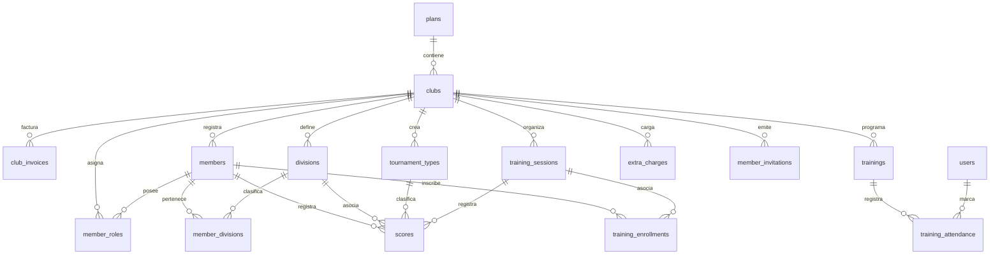

# Estructura de la Base de Datos - QuiverApp SaaS

Este documento contiene la estructura completa y actualizada de la base de datos de **QuiverApp** (Supabase / PostgreSQL), incluyendo todas las tablas principales, relaciones, tipos enumerados (Enums), vistas y funciones RPC del sistema de asistencia por geocercas GPS/QR.

---

## 1. Diagrama de Relaciones Conceptual (Mermaid)

---

## 2. Tipos Enumerados (Enums)

### `club_role`
Define los roles operativos dentro de un club de arquería:
*   `administrador`
*   `presidente`
*   `entrenador`
*   `arquero`
*   `socio`
*   `secretaria`
*   `tesorero`
*   `alumno`

### `member_status`
Define el estado de la membresía del miembro:
*   `activo`
*   `inactivo`

### `subscription_status`
Define el estado de suscripción SaaS del club:
*   `activo`
*   `pendiente`
*   `bloqueado`

### `training_type`
Clasificación de sesiones de entrenamiento estándar:
*   `libre`
*   `estandar`

---

## 3. Diccionario de Tablas

### `plans` (Planes de Suscripción SaaS)
| Columna | Tipo | Restricciones / Relación | Descripción |
| :--- | :--- | :--- | :--- |
| `id` | `UUID` | `PRIMARY KEY` | Identificador único del plan. |
| `name` | `TEXT` | `NOT NULL` | Nombre del plan (ej. Básico, Pro, Elite). |
| `description`| `TEXT` | | Descripción detallada de los beneficios. |
| `price` | `NUMERIC` | `NOT NULL` | Precio de la suscripción mensual. |
| `price_annual`| `NUMERIC` | | Precio promocional anual. |
| `student_limit`| `INTEGER`| | Límite máximo de alumnos permitido por plan. |
| `features` | `JSON` | | Características del plan en formato JSON. |
| `is_active` | `BOOLEAN` | | Define si el plan está disponible para contratación. |
| `display_order`| `INTEGER`| | Orden de visualización en la landing page. |
| `created_at` | `TIMESTAMPTZ`| | Fecha de creación del registro. |

---

### `clubs` (Organizaciones / Inquilinos SaaS)
| Columna | Tipo | Restricciones / Relación | Descripción |
| :--- | :--- | :--- | :--- |
| `id` | `UUID` | `PRIMARY KEY` | Identificador único del club (tenant_id). |
| `name` | `TEXT` | `NOT NULL` | Nombre del club de arquería. |
| `contact_email`| `TEXT` | | Email de contacto administrativo. |
| `logo_url` | `TEXT` | | URL de la imagen del logotipo. |
| `inscription_fee`| `NUMERIC`| | Costo de la cuota de inscripción del club. |
| `monthly_fee`| `NUMERIC` | | Cuota mensual estándar del club para sus miembros. |
| `plan_id` | `UUID` | `REFERENCES plans(id)` | Plan SaaS activo del club. |
| `subscription_status`| `subscription_status`| `NOT NULL` | Estado de la cuenta SaaS del club. |
| `subscription_end_date`| `TIMESTAMPTZ`| | Fecha de fin de la suscripción. |
| `city` | `TEXT` | | Ciudad de ubicación del club. |
| `country` | `TEXT` | | País de ubicación. |
| `grace_period_days`| `INTEGER`| | Días de gracia de pago para miembros. |
| `next_payment_due_date`| `TIMESTAMPTZ`| | Siguiente fecha de corte de facturación SaaS. |

---

### `members` (Perfiles de Miembros / Usuarios del Club)
| Columna | Tipo | Restricciones / Relación | Descripción |
| :--- | :--- | :--- | :--- |
| `id` | `UUID` | `PRIMARY KEY` | Identificador único de miembro. |
| `club_id` | `UUID` | `REFERENCES clubs(id)` | Club al que pertenece el perfil. |
| `user_id` | `UUID` | `REFERENCES auth.users(id)` | Enlace a la cuenta de autenticación de Supabase. |
| `full_name` | `TEXT` | `NOT NULL` | Nombre completo del arquero/socio. |
| `display_name`| `TEXT` | | Nombre o apodo para mostrar en la interfaz. |
| `email` | `TEXT` | | Dirección de correo electrónico. |
| `phone` | `TEXT` | | Teléfono de contacto. |
| `date_of_birth`| `DATE` | | Fecha de nacimiento (calcula divisiones por edad). |
| `identification`| `TEXT` | | Documento de identidad / RUT / DNI. |
| `status` | `member_status`| | Estado del miembro (activo/inactivo). |
| `emergency_contact_name`| `TEXT`| | Nombre de contacto de emergencia. |
| `emergency_contact_phone`| `TEXT`| | Teléfono de contacto de emergencia. |
| `medical_history`| `TEXT` | | Notas médicas relevantes o alergias. |
| `shirt_size` | `TEXT` | | Talla de camiseta. |
| `windbreaker_size`| `TEXT` | | Talla de cortavientos. |

---

### `member_roles` (Roles Operativos en Clubes)
| Columna | Tipo | Restricciones / Relación | Descripción |
| :--- | :--- | :--- | :--- |
| `id` | `UUID` | `PRIMARY KEY` | Identificador de la relación. |
| `member_id` | `UUID` | `REFERENCES members(id)` | Miembro asignado. |
| `club_id` | `UUID` | `REFERENCES clubs(id)` | Club donde aplica el rol. |
| `role` | `club_role`| `NOT NULL` | Rol operativo seleccionado. |

---

### `divisions` (Divisiones y Categorías de Competencia)
| Columna | Tipo | Restricciones / Relación | Descripción |
| :--- | :--- | :--- | :--- |
| `id` | `UUID` | `PRIMARY KEY` | Identificador de la división. |
| `club_id` | `UUID` | `REFERENCES clubs(id)` | Club creador (opcional, null si es del sistema). |
| `name` | `TEXT` | `NOT NULL` | Nombre de la categoría (ej. Recurvo Infantil, Raso Senior). |
| `abbreviation`| `TEXT` | `NOT NULL` | Siglas de la división (ej. RI, RS). |
| `min_age` | `INTEGER` | | Edad mínima aplicable. |
| `max_age` | `INTEGER` | | Edad máxima aplicable. |
| `gender` | `TEXT` | | Género aplicable (Femenino, Masculino, Mixto). |
| `active` | `BOOLEAN` | `DEFAULT true` | Estado de activación. |
| `is_system` | `BOOLEAN` | `DEFAULT false` | Define si es una categoría global del sistema. |

---

### `member_divisions` (Historial de Asignación de Divisiones)
| Columna | Tipo | Restricciones / Relación | Descripción |
| :--- | :--- | :--- | :--- |
| `id` | `UUID` | `PRIMARY KEY` | Identificador del registro. |
| `member_id` | `UUID` | `REFERENCES members(id)` | Miembro asociado. |
| `division_id` | `UUID` | `REFERENCES divisions(id)` | División asignada. |
| `is_primary` | `BOOLEAN` | `DEFAULT true` | Define si es la división principal del deportista. |
| `valid_from` | `TIMESTAMPTZ`| `NOT NULL` | Fecha de inicio de validez de la división. |
| `valid_until`| `TIMESTAMPTZ`| | Fecha de término de validez (nulo si es la actual). |

---

### `trainings` (Módulo GPS/QR - Programación de Clases y Geocercas)
| Columna | Tipo | Restricciones / Relación | Descripción |
| :--- | :--- | :--- | :--- |
| `id` | `UUID` | `PRIMARY KEY` | Identificador del entrenamiento GPS/QR. |
| `club_id` | `UUID` | `REFERENCES clubs(id)` | Club organizador. |
| `title` | `TEXT` | `NOT NULL` | Título del entrenamiento (ej. Clase de Precisión Sábado). |
| `starts_at` | `TIMESTAMPTZ`| `NOT NULL` | Fecha y hora de inicio de asistencia permitida. |
| `ends_at` | `TIMESTAMPTZ`| `NOT NULL` | Fecha y hora de expiración de asistencia. |
| `location_lat`| `DOUBLE` | `NOT NULL` | Latitud del centro geográfico de asistencia. |
| `location_lng`| `DOUBLE` | `NOT NULL` | Longitud del centro geográfico de asistencia. |
| `allowed_radius_meters`| `DOUBLE` | `NOT NULL DEFAULT 100.0` | Radio permitido (en metros) para validación de presencia. |
| `created_at` | `TIMESTAMPTZ`| `DEFAULT now()` | Registro de fecha de creación. |

---

### `training_attendance` (Módulo GPS/QR - Registro Seguro de Asistencia)
| Columna | Tipo | Restricciones / Relación | Descripción |
| :--- | :--- | :--- | :--- |
| `id` | `UUID` | `PRIMARY KEY` | Identificador del registro de asistencia. |
| `club_id` | `UUID` | `REFERENCES clubs(id)` | Club del registro. |
| `training_id` | `UUID` | `REFERENCES trainings(id)` | Entrenamiento asociado. |
| `user_id` | `UUID` | `REFERENCES auth.users(id)` | ID del usuario autenticado que asiste. |
| `latitude` | `DOUBLE` | | Latitud real reportada por el dispositivo móvil. |
| `longitude` | `DOUBLE` | | Longitud real reportada por el dispositivo móvil. |
| `distance_meters`| `DOUBLE`| | Distancia calculada en metros con respecto al centro del entrenamiento. |
| `ip_address` | `TEXT` | | IP de origen del dispositivo móvil. |
| `user_agent` | `TEXT` | | Navegador / SO / Dispositivo del usuario. |
| `attended_at`| `TIMESTAMPTZ`| `DEFAULT now()` | Fecha y hora exacta del check-in. |

---

### `training_sessions` (Entrenamientos Tradicionales e Historiales)
| Columna | Tipo | Restricciones / Relación | Descripción |
| :--- | :--- | :--- | :--- |
| `id` | `UUID` | `PRIMARY KEY` | Identificador de la sesión estándar. |
| `club_id` | `UUID` | `REFERENCES clubs(id)` | Club organizador. |
| `name` | `TEXT` | `NOT NULL` | Nombre descriptivo del entrenamiento. |
| `event_date` | `DATE` | `NOT NULL` | Fecha de realización. |
| `discipline` | `TEXT` | | Disciplina (indoor, outdoor, 3D, campo). |
| `distance_yards`| `INTEGER`| | Distancia estándar en yardas / metros. |
| `target_type`| `TEXT` | | Tipo de diana utilizado (122cm, 80cm, triple spot). |
| `training_type`| `training_type`| | Clasificación (libre o estándar). |
| `attendance_token`| `TEXT`| | Token QR dinámico temporal (antiguo sistema). |
| `attendance_token_expires`| `TIMESTAMPTZ`| | Fecha de expiración del token antiguo. |

---

### `training_enrollments` (Inscripciones y Asistencia Clásica)
| Columna | Tipo | Restricciones / Relación | Descripción |
| :--- | :--- | :--- | :--- |
| `id` | `UUID` | `PRIMARY KEY` | Identificador único de inscripción. |
| `club_id` | `UUID` | `REFERENCES clubs(id)` | Club asociado. |
| `member_id` | `UUID` | `REFERENCES members(id)` | Miembro inscrito. |
| `training_session_id`| `UUID`| `REFERENCES training_sessions(id)`| Sesión de entrenamiento asociada. |
| `attended` | `BOOLEAN` | `DEFAULT false` | Estado de asistencia marcado manualmente. |
| `enrolled_at`| `TIMESTAMPTZ`| `DEFAULT now()` | Fecha de inscripción. |

---

### `tournament_types` (Formatos de Torneos y Puntajes del Sistema)
| Columna | Tipo | Restricciones / Relación | Descripción |
| :--- | :--- | :--- | :--- |
| `id` | `UUID` | `PRIMARY KEY` | Identificador del formato de torneo. |
| `club_id` | `UUID` | `REFERENCES clubs(id)` | Club creador (nulo si es del sistema global). |
| `name` | `TEXT` | `NOT NULL` | Nombre (ej. WA Outdoor 70m, IFAA Indoor). |
| `ends_per_round`| `INTEGER`| `NOT NULL DEFAULT 6` | Cantidad de series o rondas. |
| `arrows_per_end`| `INTEGER`| `NOT NULL DEFAULT 5` | Flechas permitidas por serie. |
| `is_indoor` | `BOOLEAN` | `DEFAULT false` | Indica si es en recinto cerrado. |
| `active` | `BOOLEAN` | `DEFAULT true` | Si el formato está disponible. |

---

### `scores` (Registros de Puntuación de Arquería)
| Columna | Tipo | Restricciones / Relación | Descripción |
| :--- | :--- | :--- | :--- |
| `id` | `UUID` | `PRIMARY KEY` | Identificador de la planilla de puntaje. |
| `club_id` | `UUID` | `REFERENCES clubs(id)` | Club donde se registró. |
| `member_id` | `UUID` | `REFERENCES members(id)` | Arquero que obtuvo los puntos. |
| `tournament_type_id`| `UUID`| `REFERENCES tournament_types(id)`| Formato de competencia utilizado. |
| `division_id` | `UUID` | `REFERENCES divisions(id)` | Categoría del arquero al momento de tirar. |
| `score_date` | `DATE` | `NOT NULL` | Fecha del registro. |
| `ends` | `JSON` | `NOT NULL` | Arreglo JSON conteniendo los puntajes flecha por flecha y serie por serie. |
| `total_score` | `INTEGER` | `NOT NULL` | Puntaje total acumulado (calculado en frontend/validador). |
| `x_count` | `INTEGER` | | Cantidad de centros X / 10s perfectos logrados. |
| `target_type` | `TEXT` | | Tipo de diana. |

---

### `financial_entries` (Ingresos y Egresos del Club)
| Columna | Tipo | Restricciones / Relación | Descripción |
| :--- | :--- | :--- | :--- |
| `id` | `UUID` | `PRIMARY KEY` | Identificador de la transacción de caja. |
| `club_id` | `UUID` | `REFERENCES clubs(id)` | Club propietario de los fondos. |
| `amount` | `NUMERIC` | `NOT NULL` | Monto de la transacción (positivo para ingresos, negativo para gastos). |
| `type` | `TEXT` | `NOT NULL` | Tipo de movimiento (`ingreso` / `egreso`). |
| `category` | `TEXT` | `NOT NULL` | Categoría (Membresía, Equipo, Torneo, Arriendo, Luz, Insumos, etc.). |
| `entry_date` | `DATE` | `NOT NULL` | Fecha de la operación. |
| `member_id` | `UUID` | `REFERENCES members(id)` | Miembro que realizó el pago (ej. pago de cuota mensual). |
| `payment_month`| `INTEGER`| | Mes asociado (1-12) si es pago de cuota. |
| `payment_year` | `INTEGER`| | Año asociado si es pago de cuota. |
| `receipt_url` | `TEXT` | | Enlace a la foto/PDF del comprobante de transferencia o boleta. |

---

## 4. Vistas Operativas (Views)

### `public_clubs_view`
Permite listar información básica no confidencial de los clubes registrados en la plataforma (empleado principalmente en pantallas de pre-registro e invitación).
*   **Campos**: `id`, `name`, `logo_url`, `city`, `country`, `inscription_fee`, `monthly_fee`.

---

## 5. Funciones RPC Clave (Seguridad / Transacciones)

### `check_in_attendance`
Procedimiento almacenado transaccional transado como `SECURITY DEFINER` (bypass RLS controlado) para registrar asistencia móvil GPS/QR de forma 100% segura y a prueba de fraudes:
1.  **Parámetros**:
    *   `p_training_id UUID`
    *   `p_latitude DOUBLE PRECISION`
    *   `p_longitude DOUBLE PRECISION`
    *   `p_ip_address TEXT`
    *   `p_user_agent TEXT`
2.  **Validaciones incorporadas**:
    *   Autenticación requerida (valida contra `auth.uid()`).
    *   Pertenencia y estado activo en el club (`members.status = 'activo'`).
    *   Rol operativo de **arquero** asignado (`member_roles.role = 'arquero'`).
    *   Validez de horario (compara `now()` contra la ventana `starts_at` y `ends_at`).
    *   Prevención de duplicidad de check-in (`training_attendance` único por sesión/usuario).
    *   Fórmula Haversine integrada para comparar distancia contra el radio permitido configurado en `trainings.allowed_radius_meters`.
3.  **Resultado**: Retorna JSON `{ success: boolean, code: TEXT, message: TEXT, distance_meters: NUMERIC }`.

### `calculate_distance`
Implementa de forma nativa la **Fórmula de Haversine** para calcular la distancia ortodrómica exacta (en metros) entre dos coordenadas de latitud/longitud en la superficie terrestre, asumiendo un radio esférico terrestre medio de 6,371 km.
